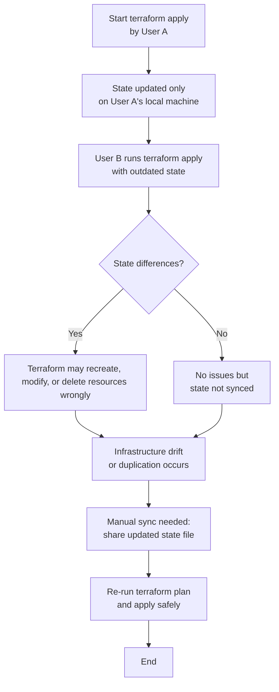
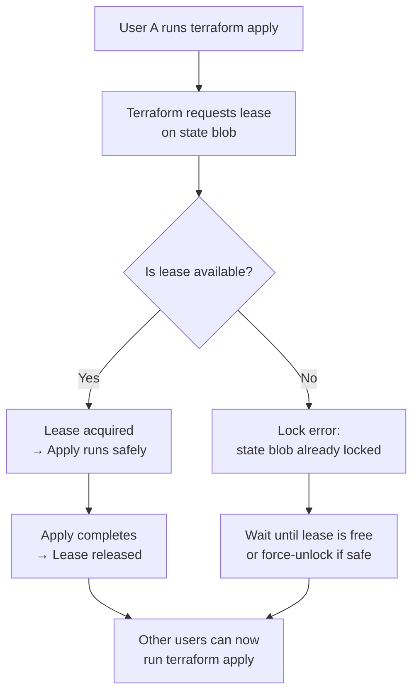

<p align="center">
  
</p>

### Question 1: You need to manage multiple environments (e.g., dev, staging, production) using Terraform. How would you structure your Terraform configuration to ensure consistency across environments while allowing environment-specific customizations?
<details>

- Modules: Create reusable modules for components like networks, compute instances, and storage that are shared across environments. These modules are stored in the modules/ directory.
- Use terraform.tfvars within each environment directory to define environment-specific variables (e.g., instance sizes, number of instances, or environment-specific tags).
- Define the backend.tf file in each environment's directory to specify the remote backend for storing the Terraform state files.
- Store your Terraform configurations in a version control system like Git. Each environment can be managed in a separate branch if necessary.
</details>

### Question 2: You accidentally committed your Terraform state file to a public repository. What are the risks involved, and how would you mitigate this issue?

<details>

- Immediately Remove the State File from the Repository
- Revoke Compromised Credentials: Immediately revoke any exposed API keys, provider credentials, or secrets found in the state file.
- Rotate Credentials: Generate new credentials and update your Terraform provider configurations to use them.
- Review Logs: Check cloud provider logs for any unauthorized access or suspicious activity that may have occurred using the exposed credentials
</details>

### Question 3. You are using a remote backend with S3 for storing the Terraform state file and DynamoDB for state locking. Suddenly, a `terraform apply' command is blocked because the state is locked. How would you resolve this?
<details>

- Only manually remove the lock if you are certain that no other Terraform operations are running, as this can lead to state corruption if done incorrectly.

- Remove the Lock Using AWS Management Console:
Select the locked item in the DynamoDB table and delete it.

</details>


### Question 4. What will Exactly Happen when you hit `terraform init` ?
<details>


1. Initialize backend

If you’re storing state remotely (e.g., Azure Storage, S3, Terraform Cloud), it sets that up.

If no backend is defined, it just uses a local terraform.tfstate file.


2. Download providers

Terraform checks the terraform block → required_providers.

It downloads the correct versions (e.g., azurerm, vault, azapi) from the Terraform Registry.

Saves them in .terraform folder locally.


3. Check versions

Confirms your Terraform CLI version meets the required_version.

Verifies provider plugin versions match what you specified.


4. Prepare modules (if any)

If your code uses external modules (source = "git... or registry"), Terraform downloads them into .terraform/modules.


5. Lock dependencies

Creates/updates .terraform.lock.hcl → keeps track of exact provider versions, so builds are reproducible across environments.


---

🔎 In short:

terraform init =
📦 Download providers + modules
🗂️ Setup backend
🔒 Lock versions

It’s like “installing dependencies” in programming (similar to npm install or pip install).


---


</details>

### Question 5. If you have a `terraform apply` running and someone else pushes state changes, what happens to your local operation and how do you recover safely?


<details>

### 🌍 Terraform Apply Without Remote Backend


---


- State file (`terraform.tfstate`) is stored **only on local machine**.  
- Each user has their **own copy of state**.  
- Terraform has **no locking and no sync**, so:  
  - Resource drift can occur.  
  - Duplicate resources may be created.  
  - Existing resources may be deleted/overwritten.  

---

## 📌 Example:
- **User A** runs `terraform apply` → creates VM `vm1`.  
- State file updated only on **User A’s machine**.  
- **User B** runs `terraform apply` → since their state doesn’t know about `vm1`, Terraform may:  
  - Try to **recreate `vm1`**.  
  - Or delete/update resources incorrectly.  
  - Result → **conflicts and downtime**.

---

## ✅ Recovery:
1. Stop the apply immediately.  
2. Share the latest `terraform.tfstate` with the team.  
3. Run:
   ```bash
   terraform refresh
   ```

</details>

<details>

### 🌍 Terraform State Locking with Azure Blob Storage


If I enable state locking with **Azure Blob Storage**, what happens?

---

## 🔎 Explanation:
- **State locking** prevents multiple people from modifying the same Terraform state at the same time.  
- Azure Blob itself does **not natively lock state**, but Terraform uses **Azure Blob leases** to implement locking.  

### How it works:
1. When you run `terraform apply`, Terraform requests a **lease** on the state blob.  
2. If lease is granted → You hold the lock and your operation runs safely.  
3. If someone else tries to run Terraform at the same time → They get an error:  

4. Once your operation finishes → Lease is released → Others can continue.  

---

## 📌 Example:
- **User A** runs `terraform apply` → acquires lease on blob.  
- **User B** runs `terraform apply` at the same time → gets lock error.  
- **User B** must wait until **User A’s apply finishes**.  

---

## ✅ Recovery if Locked:
- If another person is applying → **wait until their operation completes**.  
- If Terraform crashed and didn’t release lock → use:  
```bash
terraform force-unlock <LOCK_ID>

```


</details>

### Question 6. You are storing your Terraform state in Azure Blob Storage. One of your teammates accidentally overwrites the `terraform.tfstate` file with an invalid state or Accidentaly delete the ``terraform.tfstate` file 👉 How do you recover?

<details>

---

Azure Blob Storage supports **versioning**.

* Every time the `terraform.tfstate` file is updated, **a new version is created automatically**.
* If someone **overwrites** or **deletes** the file, you can **roll back to a previous version**.

#### Recovery Steps:

1. Go to your **Azure Blob Storage account** in the portal.
2. Open the container where `terraform.tfstate` is stored.
3. Enable **Show Deleted/Versioned Blobs**.
4. Select the **previous valid version** of the `terraform.tfstate`.
5. **Promote or restore** that version to make it the current state file.

👉 This ensures Terraform continues working without re-creating all resources.

---


---

### 🔹 What is Soft Delete in Azure Blob Storage?

Soft delete protects your data from accidental deletion or overwrite.

* When enabled, if someone **deletes** or **overwrites** the `terraform.tfstate` file, Azure **keeps a recoverable copy** for a retention period (you decide the number of days).
* You can then restore the file anytime within that retention period.

---

## 🔹 How to Enable Soft Delete for Azure Blob Storage

### Using **Azure Portal**

1. Go to your **Storage Account** in the Azure portal.
2. In the left-hand menu, under **Data Management**, click **Data protection**.
3. Find **Blob soft delete**.
4. Toggle it to **Enabled**.
5. Set the **retention period** (e.g., 7, 14, or 30 days).
6. Click **Save**.

---


  
</details>

### Question 7. What is the difference between `count` and `for_each` in Terraform? Can you give an example of when you would use one over the other?

<details>

---

## 🔹 `count` vs `for_each` in Terraform

### 1. **count**

* Creates multiple **instances of a resource** based on a number.
* Indexed using **numeric indices** (`0,1,2,…`).
* Best when you need **a fixed number of identical resources**.

👉 Example:

```hcl
resource "azurerm_resource_group" "example" {
  count    = 2
  name     = "rg-${count.index}"
  location = "East US"
}
```

✅ Creates `rg-0` and `rg-1`.
⚠️ But if you remove one, the indices can **shift**, causing Terraform to recreate resources unnecessarily.

---

### 2. **for\_each**

* Creates multiple resource instances based on **map** 
* Indexed using **keys**, not numbers.
* Best when you need resources with **unique identifiers**.

👉 Example:

```hcl
resource "azurerm_resource_group" "example" {
  for_each = {
    dev  = "DevRG"
    prod = "ProdRG"
  }

  name     = each.value
  location = "East US"
}
```
### 🔎 How it works:

* `for_each` is looping over the map `{ dev = "DevRG", prod = "ProdRG" }`.
* `each.key` → gives the key (`dev`, `prod`).
* `each.value` → gives the value (`DevRG`, `ProdRG`).

### ✅ Result:

Terraform will create **two resource groups**:

1. `azurerm_resource_group.example["dev"]` → with name **DevRG**
2. `azurerm_resource_group.example["prod"]` → with name **ProdRG**


✅ Creates `example["dev"]` and `example["prod"]`.
⚠️ If you remove one key (`prod`), **only that resource is destroyed** (no index shifting issue).

---


## ⚡Difference

* Use **`count`** → when you just need “N copies” of something.
* Use **`for_each`** → when you want to manage resources with meaningful **keys** (e.g., `dev`, `prod`, `qa`).

---
</details>


### Question 8. When using `for_each` with a map, if you remove a key from the map, will Terraform destroy the associated resource or just ignore it?
<details>
  
---

## ✅ Explanation with Example

Let’s take the same `for_each` scenario:

### Initial Code

```hcl
resource "azurerm_resource_group" "example" {
  for_each = {
    dev  = "DevRG"
    prod = "ProdRG"
  }

  name     = each.value
  location = "East US"
}
```

👉 Terraform creates:

* `example["dev"]` → DevRG
* `example["prod"]` → ProdRG

---

### Modified Code (remove `prod`)

```hcl
resource "azurerm_resource_group" "example" {
  for_each = {
    dev = "DevRG"
  }

  name     = each.value
  location = "East US"
}
```

👉 On next `terraform plan` / `apply`:

* `example["dev"]` → stays (unchanged ✅)
* `example["prod"]` → destroyed ❌ because the `prod` key is no longer in the map

---

## ⚡ Key Point

* `for_each` ties each resource to a **map key**.
* If the key disappears, Terraform considers the resource **orphaned** and **destroys it**.
* Terraform never ignores missing keys, otherwise it would create **state drift** (infrastructure not matching config).

---

## 🔹 Compared to `count`

* With `count`, removing an element in the middle can cause **index shifting**, leading to accidental re-creations.
* With `for_each`, removing a key only deletes **that one resource** → safer and more predictable.

---

</details>


