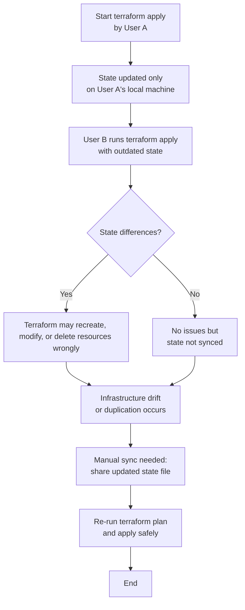

<p align="center">
  
</p>

### Question 1: You need to manage multiple environments (e.g., dev, staging, production) using Terraform. How would you structure your Terraform configuration to ensure consistency across environments while allowing environment-specific customizations?
<details>

- Modules: Create reusable modules for components like networks, compute instances, and storage that are shared across environments. These modules are stored in the modules/ directory.
- Use terraform.tfvars within each environment directory to define environment-specific variables (e.g., instance sizes, number of instances, or environment-specific tags).
- Define the backend.tf file in each environment's directory to specify the remote backend for storing the Terraform state files.
- Store your Terraform configurations in a version control system like Git. Each environment can be managed in a separate branch if necessary.
</details>

### Question 2: You accidentally committed your Terraform state file to a public repository. What are the risks involved, and how would you mitigate this issue?

<details>

- Immediately Remove the State File from the Repository
- Revoke Compromised Credentials: Immediately revoke any exposed API keys, provider credentials, or secrets found in the state file.
- Rotate Credentials: Generate new credentials and update your Terraform provider configurations to use them.
- Review Logs: Check cloud provider logs for any unauthorized access or suspicious activity that may have occurred using the exposed credentials
</details>

### Question 3. You are using a remote backend with S3 for storing the Terraform state file and DynamoDB for state locking. Suddenly, a `terraform apply' command is blocked because the state is locked. How would you resolve this?
<details>

- Only manually remove the lock if you are certain that no other Terraform operations are running, as this can lead to state corruption if done incorrectly.

- Remove the Lock Using AWS Management Console:
Select the locked item in the DynamoDB table and delete it.

</details>


### Question 4. What will Exactly Happen when you hit `terraform init` ?
<details>


1. Initialize backend

If you’re storing state remotely (e.g., Azure Storage, S3, Terraform Cloud), it sets that up.

If no backend is defined, it just uses a local terraform.tfstate file.


2. Download providers

Terraform checks the terraform block → required_providers.

It downloads the correct versions (e.g., azurerm, vault, azapi) from the Terraform Registry.

Saves them in .terraform folder locally.


3. Check versions

Confirms your Terraform CLI version meets the required_version.

Verifies provider plugin versions match what you specified.


4. Prepare modules (if any)

If your code uses external modules (source = "git... or registry"), Terraform downloads them into .terraform/modules.


5. Lock dependencies

Creates/updates .terraform.lock.hcl → keeps track of exact provider versions, so builds are reproducible across environments.


---

🔎 In short:

terraform init =
📦 Download providers + modules
🗂️ Setup backend
🔒 Lock versions

It’s like “installing dependencies” in programming (similar to npm install or pip install).


---


</details>

### Question 5. If you have a `terraform apply` running and someone else pushes state changes, what happens to your local operation and how do you recover safely?


<details>
# 🌍 Terraform Apply Without Remote Backend


---


- State file (`terraform.tfstate`) is stored **only on local machine**.  
- Each user has their **own copy of state**.  
- Terraform has **no locking and no sync**, so:  
  - Resource drift can occur.  
  - Duplicate resources may be created.  
  - Existing resources may be deleted/overwritten.  

---

## 📌 Example:
- **User A** runs `terraform apply` → creates VM `vm1`.  
- State file updated only on **User A’s machine**.  
- **User B** runs `terraform apply` → since their state doesn’t know about `vm1`, Terraform may:  
  - Try to **recreate `vm1`**.  
  - Or delete/update resources incorrectly.  
  - Result → **conflicts and downtime**.

---

## ✅ Recovery:
1. Stop the apply immediately.  
2. Share the latest `terraform.tfstate` with the team.  
3. Run:
   ```bash
   terraform refresh
   ```

</details>
