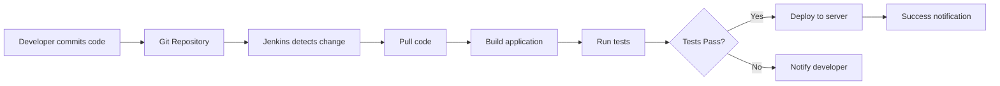

### Question 1. What is Jenkins ?
<Details>

### Jenkins is an open-source automation server used to automate software development tasks.

### In simple words:
👉 **Jenkins does the work automatically that developers otherwise do manually.**

---

## 🎯 Primary Use of Jenkins

The primary use of Jenkins is **CI/CD**:

### 1️⃣ **Continuous Integration (CI)**

- ✅ Automatically **builds code** when developers push changes
- ✅ **Runs tests** to catch bugs early
- ✅ Provides immediate feedback on code quality
- ✅ Detects integration issues quickly

**Example:**
```
Developer pushes code to Git
       ↓
Jenkins automatically:
  → Pulls the code
  → Builds the application
  → Runs unit tests
  → Reports results
```

---

### 2️⃣ **Continuous Delivery / Deployment (CD)**

- ✅ Automatically **deploys applications** to servers
- ✅ Ensures **faster and reliable** releases
- ✅ Reduces manual deployment errors
- ✅ Enables frequent releases

**Example:**
```
Tests pass successfully
       ↓
Jenkins automatically:
  → Builds Docker image
  → Pushes to registry
  → Deploys to Kubernetes
  → Notifies team
```

---


---

## 🎓 Extended Interview Answers

### **For Junior Roles:**
> *"Jenkins is an automation tool that helps developers automatically build, test, and deploy their code. Instead of doing these tasks manually, Jenkins does them automatically whenever code changes are pushed to version control."*

### **For Senior Roles:**
> *"Jenkins is an open-source automation server that orchestrates CI/CD pipelines. It integrates with SCM tools like Git, automates build processes using tools like Maven or Gradle, runs test suites, and deploys applications to various environments including containers and cloud platforms. It supports pipeline-as-code through Jenkinsfiles and has an extensive plugin ecosystem."*

---

## 🔍 How Jenkins Works - Simple Flow



**Step-by-step:**

1. 👨‍💻 **Developer commits code** to Git
2. 🔔 **Jenkins detects the change** (webhook or polling)
3. 📥 **Jenkins pulls** the latest code
4. 🏗️ **Builds** the application
5. 🧪 **Runs automated tests**
6. ✅ If tests **pass** → **Deploy to server**
7. ❌ If tests **fail** → **Notify developer**
8. 📧 **Send notification** about build status

---

## 🛠️ Key Jenkins Features

### 1. **Pipeline Support**
- Define entire CI/CD workflow as code
- Version control your pipelines
- Reusable and maintainable

```groovy
pipeline {
    agent any
    stages {
        stage('Build') {
            steps {
                sh 'mvn clean package'
            }
        }
        stage('Test') {
            steps {
                sh 'mvn test'
            }
        }
        stage('Deploy') {
            steps {
                sh './deploy.sh'
            }
        }
    }
}


            }
        }
    }
    
    post {
        success {
            slackSend color: 'good', message: "Build Successful: ${BUILD_NUMBER}"
        }
        failure {
            slackSend color: 'danger', message: "Build Failed: ${BUILD_NUMBER}"
        }
    }
}
```

</details>


### Question 2. What is a Jenkins Pipeline ?

<details>

**A Jenkins Pipeline is a way to define your entire software delivery process as code.**

### In simple words:
👉 **It tells Jenkins how to build, test, and deploy your application step by step, using a script.**

---

## 📋 Key Components Explained

### 1️⃣ **Suite of Plugins**

- Jenkins Pipeline is **not a single feature**
- It is a **collection (suite) of Jenkins plugins**
- These plugins work together to support pipelines

**Core Pipeline Plugins:**
- Pipeline plugin
- Pipeline: Declarative plugin
- Pipeline: Stage View plugin
- Pipeline: Groovy plugin

👉 **That's why Jenkins is very flexible and extensible.**

---

### 2️⃣ **Pipeline as Code**

The pipeline is written as **code** (usually in a file called `Jenkinsfile`)

This file is stored in the **same Git repository** as your application code

**Example structure:**
```
my-app/
├── src/
├── pom.xml
├── Dockerfile
└── Jenkinsfile  ← Pipeline definition
```


## ⭐ One-Line Definition (For Interviews)

> **"A Jenkins Pipeline is a suite of plugins that allows us to define build, test, and deployment workflows as code, which can be version-controlled along with application code."**

---
</details>


### Question 3.  What is a Jenkins Agent (Node)?

<details>

**A Jenkins Agent (also called a Node) is a machine that actually runs the job.**

### Key Concept:
👉 **Jenkins does not do the work itself.**  
👉 **It sends the work to agents.**

---

## 🧠 In Simple Words

| Component | Role | Description |
|-----------|------|-------------|
| **Jenkins Server (Master)** | 🧠 **Brain** | Decides what to do, schedules jobs |
| **Jenkins Agent (Node)** | 💪 **Worker** | Actually executes the work |

**The server decides what to do,**  
**the agent decides where and runs it.**

---

## 🔧 What Does a Jenkins Agent Do?

A Jenkins Agent:

- ✅ **Runs build, test, and deployment tasks**
- ✅ **Executes jobs** sent by the Jenkins server
- ✅ **Provides execution environment** for pipelines
- ✅ **Reports results** back to master

### **Agent Types:**

Can be:
- 🖥️ **Physical machine** (dedicated server)
- ☁️ **Virtual machine** (VM in cloud)
- 🐳 **Docker container** (most flexible)
- ☸️ **Kubernetes pod** (for cloud-native)

---
</details>

### Question 4. What is Jenkins Plugins ?
<details>

### Jenkins plugins are used to extend and enhance the functionality of Jenkins.

👉 Jenkins by default is very basic  
👉 Plugins add extra features and powers

## Simple Analogy

Think of Jenkins as a **mobile phone** 📱  
Plugins are **apps** you install to add new features.

## What do Jenkins Plugins do?

Jenkins plugins help Jenkins to:

### 🔹 Add Additional Features
- Extra options and capabilities
- Makes Jenkins more powerful

### 🔹 Integrate with Other Tools
Plugins allow Jenkins to connect with:
- **Git, GitHub, Bitbucket** (source code)
- **Docker, Kubernetes**
- **Cloud platforms** (AWS, Azure)
- **Slack, Email** (notifications)

### 🔹 Source Code Management
- Pull code from repositories
- **Example:** Git plugin
</details>

### Question 5. Explain Difference between Scripted and Declarative Jenkins Pipelines ?

<details>

## 🔹 Scripted Pipeline

- Uses **Groovy scripting language**
- Gives **more flexibility and control**
- You can write complex logic (loops, conditions, custom code)
- But it needs **more coding effort**
- Slightly **harder to read and maintain**

👉 **Best when you need advanced or complex pipeline logic**

---

## 🔹 Declarative Pipeline

- Uses a **simple and structured syntax**
- **Easy to read, write, and maintain**
- Follows **predefined rules and format**
- **Less flexible** than scripted, but clean and clear

👉 **Best for standard CI/CD pipelines and beginners**

---

## Quick Comparison

| Feature | Scripted Pipeline | Declarative Pipeline |
|---------|------------------|---------------------|
| **Language** | Groovy scripting | Structured syntax |
| **Flexibility** | High | Moderate |
| **Complexity** | Can handle complex logic | Better for standard workflows |
| **Readability** | Harder to read | Easy to read |
| **Learning Curve** | Steeper | Beginner-friendly |
| **Best For** | Advanced/complex pipelines | Standard CI/CD pipelines |
</details>

### Question 5. How to Secure Jenkins ?

<details>


Jenkins can be secured by using **authentication**, **authorization**, **encryption**, and **security plugins**.

## Simple Explanation (Step by Step)

### 🔐 1. Enable Authentication

**Authentication** means **who can log in** to Jenkins.

Jenkins supports:
- **LDAP** – login using company directory
- **Active Directory** – Windows-based authentication
- **OAuth** – login using Google, GitHub, etc.

👉 Only valid users can access Jenkins.

---

### 🧑‍💼 2. Use Role-Based Access Control (RBAC)

**Authorization** means **what users can do** after login.

**Assign roles to users and groups**

**Example:**
- **Admin** → full access
- **Developer** → run builds
- **Viewer** → read-only access

👉 This prevents unauthorized changes.

---

### 🔒 3. Enable HTTPS Encryption

Use **HTTPS** instead of HTTP

**Encrypts data between:**
- Browser and Jenkins
- Jenkins and agents

👉 Protects passwords and sensitive data.

---

### 🛡️ 4. Install Security Plugins

- Install Jenkins security plugins
- Helps protect against vulnerabilities
- Adds extra layers of protection

---

## Quick Security Checklist

- [ ] Enable authentication (LDAP, OAuth, Active Directory)
- [ ] Configure Role-Based Access Control (RBAC)
- [ ] Enable HTTPS encryption
- [ ] Install and update security plugins
- [ ] Regularly update Jenkins to latest version
- [ ] Review user permissions periodically
</details>
