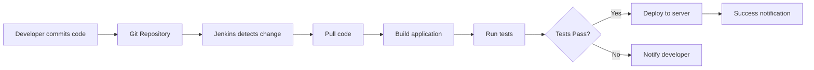

### Question 1. What is Jenkins ?
<Details>

### Jenkins is an open-source automation server used to automate software development tasks.

### In simple words:
👉 **Jenkins does the work automatically that developers otherwise do manually.**

---

## 🎯 Primary Use of Jenkins

The primary use of Jenkins is **CI/CD**:

### 1️⃣ **Continuous Integration (CI)**

- ✅ Automatically **builds code** when developers push changes
- ✅ **Runs tests** to catch bugs early
- ✅ Provides immediate feedback on code quality
- ✅ Detects integration issues quickly

**Example:**
```
Developer pushes code to Git
       ↓
Jenkins automatically:
  → Pulls the code
  → Builds the application
  → Runs unit tests
  → Reports results
```

---

### 2️⃣ **Continuous Delivery / Deployment (CD)**

- ✅ Automatically **deploys applications** to servers
- ✅ Ensures **faster and reliable** releases
- ✅ Reduces manual deployment errors
- ✅ Enables frequent releases

**Example:**
```
Tests pass successfully
       ↓
Jenkins automatically:
  → Builds Docker image
  → Pushes to registry
  → Deploys to Kubernetes
  → Notifies team
```

---


---

## 🎓 Extended Interview Answers

### **For Junior Roles:**
> *"Jenkins is an automation tool that helps developers automatically build, test, and deploy their code. Instead of doing these tasks manually, Jenkins does them automatically whenever code changes are pushed to version control."*

### **For Senior Roles:**
> *"Jenkins is an open-source automation server that orchestrates CI/CD pipelines. It integrates with SCM tools like Git, automates build processes using tools like Maven or Gradle, runs test suites, and deploys applications to various environments including containers and cloud platforms. It supports pipeline-as-code through Jenkinsfiles and has an extensive plugin ecosystem."*

---

## 🔍 How Jenkins Works - Simple Flow



**Step-by-step:**

1. 👨‍💻 **Developer commits code** to Git
2. 🔔 **Jenkins detects the change** (webhook or polling)
3. 📥 **Jenkins pulls** the latest code
4. 🏗️ **Builds** the application
5. 🧪 **Runs automated tests**
6. ✅ If tests **pass** → **Deploy to server**
7. ❌ If tests **fail** → **Notify developer**
8. 📧 **Send notification** about build status

---

## 🛠️ Key Jenkins Features

### 1. **Pipeline Support**
- Define entire CI/CD workflow as code
- Version control your pipelines
- Reusable and maintainable

```groovy
pipeline {
    agent any
    stages {
        stage('Build') {
            steps {
                sh 'mvn clean package'
            }
        }
        stage('Test') {
            steps {
                sh 'mvn test'
            }
        }
        stage('Deploy') {
            steps {
                sh './deploy.sh'
            }
        }
    }
}


            }
        }
    }
    
    post {
        success {
            slackSend color: 'good', message: "Build Successful: ${BUILD_NUMBER}"
        }
        failure {
            slackSend color: 'danger', message: "Build Failed: ${BUILD_NUMBER}"
        }
    }
}
```

</details>

