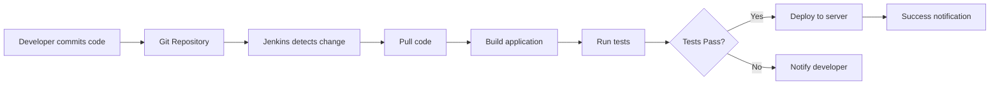

<p align="center">
  

### Question 1. What is Jenkins ?
<Details>

### Jenkins is an open-source automation server used to automate software development tasks.

### In simple words:
👉 **Jenkins does the work automatically that developers otherwise do manually.**

---

## 🎯 Primary Use of Jenkins

The primary use of Jenkins is **CI/CD**:

### 1️⃣ **Continuous Integration (CI)**

- ✅ Automatically **builds code** when developers push changes
- ✅ **Runs tests** to catch bugs early
- ✅ Provides immediate feedback on code quality
- ✅ Detects integration issues quickly

**Example:**
```
Developer pushes code to Git
       ↓
Jenkins automatically:
  → Pulls the code
  → Builds the application
  → Runs unit tests
  → Reports results
```

---

### 2️⃣ **Continuous Delivery / Deployment (CD)**

- ✅ Automatically **deploys applications** to servers
- ✅ Ensures **faster and reliable** releases
- ✅ Reduces manual deployment errors
- ✅ Enables frequent releases

**Example:**
```
Tests pass successfully
       ↓
Jenkins automatically:
  → Builds Docker image
  → Pushes to registry
  → Deploys to Kubernetes
  → Notifies team
```

---


---

## 🎓 Extended Interview Answers

### **For Junior Roles:**
> *"Jenkins is an automation tool that helps developers automatically build, test, and deploy their code. Instead of doing these tasks manually, Jenkins does them automatically whenever code changes are pushed to version control."*

### **For Senior Roles:**
> *"Jenkins is an open-source automation server that orchestrates CI/CD pipelines. It integrates with SCM tools like Git, automates build processes using tools like Maven or Gradle, runs test suites, and deploys applications to various environments including containers and cloud platforms. It supports pipeline-as-code through Jenkinsfiles and has an extensive plugin ecosystem."*

---

## 🔍 How Jenkins Works - Simple Flow



**Step-by-step:**

1. 👨‍💻 **Developer commits code** to Git
2. 🔔 **Jenkins detects the change** (webhook or polling)
3. 📥 **Jenkins pulls** the latest code
4. 🏗️ **Builds** the application
5. 🧪 **Runs automated tests**
6. ✅ If tests **pass** → **Deploy to server**
7. ❌ If tests **fail** → **Notify developer**
8. 📧 **Send notification** about build status

---

## 🛠️ Key Jenkins Features

### 1. **Pipeline Support**
- Define entire CI/CD workflow as code
- Version control your pipelines
- Reusable and maintainable

```groovy
pipeline {
    agent any
    stages {
        stage('Build') {
            steps {
                sh 'mvn clean package'
            }
        }
        stage('Test') {
            steps {
                sh 'mvn test'
            }
        }
        stage('Deploy') {
            steps {
                sh './deploy.sh'
            }
        }
    }
}


            }
        }
    }
    
    post {
        success {
            slackSend color: 'good', message: "Build Successful: ${BUILD_NUMBER}"
        }
        failure {
            slackSend color: 'danger', message: "Build Failed: ${BUILD_NUMBER}"
        }
    }
}
```

</details>


### Question 2. What is a Jenkins Pipeline ?

<details>

**A Jenkins Pipeline is a way to define your entire software delivery process as code.**

### In simple words:
👉 **It tells Jenkins how to build, test, and deploy your application step by step, using a script.**

---

## 📋 Key Components Explained

### 1️⃣ **Suite of Plugins**

- Jenkins Pipeline is **not a single feature**
- It is a **collection (suite) of Jenkins plugins**
- These plugins work together to support pipelines

**Core Pipeline Plugins:**
- Pipeline plugin
- Pipeline: Declarative plugin
- Pipeline: Stage View plugin
- Pipeline: Groovy plugin

👉 **That's why Jenkins is very flexible and extensible.**

---

### 2️⃣ **Pipeline as Code**

The pipeline is written as **code** (usually in a file called `Jenkinsfile`)

This file is stored in the **same Git repository** as your application code

**Example structure:**
```
my-app/
├── src/
├── pom.xml
├── Dockerfile
└── Jenkinsfile  ← Pipeline definition
```


## ⭐ One-Line Definition (For Interviews)

> **"A Jenkins Pipeline is a suite of plugins that allows us to define build, test, and deployment workflows as code, which can be version-controlled along with application code."**

---
</details>


### Question 3.  What is a Jenkins Agent (Node)?

<details>

**A Jenkins Agent (also called a Node) is a machine that actually runs the job.**

### Key Concept:
👉 **Jenkins does not do the work itself.**  
👉 **It sends the work to agents.**

---

## 🧠 In Simple Words

| Component | Role | Description |
|-----------|------|-------------|
| **Jenkins Server (Master)** | 🧠 **Brain** | Decides what to do, schedules jobs |
| **Jenkins Agent (Node)** | 💪 **Worker** | Actually executes the work |

**The server decides what to do,**  
**the agent decides where and runs it.**

---

## 🔧 What Does a Jenkins Agent Do?

A Jenkins Agent:

- ✅ **Runs build, test, and deployment tasks**
- ✅ **Executes jobs** sent by the Jenkins server
- ✅ **Provides execution environment** for pipelines
- ✅ **Reports results** back to master

### **Agent Types:**

Can be:
- 🖥️ **Physical machine** (dedicated server)
- ☁️ **Virtual machine** (VM in cloud)
- 🐳 **Docker container** (most flexible)
- ☸️ **Kubernetes pod** (for cloud-native)

---
</details>

### Question 4. What is Jenkins Plugins ?
<details>

### Jenkins plugins are used to extend and enhance the functionality of Jenkins.

👉 Jenkins by default is very basic  
👉 Plugins add extra features and powers

## Simple Analogy

Think of Jenkins as a **mobile phone** 📱  
Plugins are **apps** you install to add new features.

## What do Jenkins Plugins do?

Jenkins plugins help Jenkins to:

### 🔹 Add Additional Features
- Extra options and capabilities
- Makes Jenkins more powerful

### 🔹 Integrate with Other Tools
Plugins allow Jenkins to connect with:
- **Git, GitHub, Bitbucket** (source code)
- **Docker, Kubernetes**
- **Cloud platforms** (AWS, Azure)
- **Slack, Email** (notifications)

### 🔹 Source Code Management
- Pull code from repositories
- **Example:** Git plugin
</details>

### Question 5. Explain Difference between Scripted and Declarative Jenkins Pipelines ?

<details>

## 🔹 Scripted Pipeline

- Uses **Groovy scripting language**
- Gives **more flexibility and control**
- You can write complex logic (loops, conditions, custom code)
- But it needs **more coding effort**
- Slightly **harder to read and maintain**

👉 **Best when you need advanced or complex pipeline logic**

---

## 🔹 Declarative Pipeline

- Uses a **simple and structured syntax**
- **Easy to read, write, and maintain**
- Follows **predefined rules and format**
- **Less flexible** than scripted, but clean and clear

👉 **Best for standard CI/CD pipelines and beginners**

---

## Quick Comparison

| Feature | Scripted Pipeline | Declarative Pipeline |
|---------|------------------|---------------------|
| **Language** | Groovy scripting | Structured syntax |
| **Flexibility** | High | Moderate |
| **Complexity** | Can handle complex logic | Better for standard workflows |
| **Readability** | Harder to read | Easy to read |
| **Learning Curve** | Steeper | Beginner-friendly |
| **Best For** | Advanced/complex pipelines | Standard CI/CD pipelines |
</details>

### Question 6. How to Secure Jenkins ?

<details>


Jenkins can be secured by using **authentication**, **authorization**, **encryption**, and **security plugins**.

## Simple Explanation (Step by Step)

### 🔐 1. Enable Authentication

**Authentication** means **who can log in** to Jenkins.

Jenkins supports:
- **LDAP** – login using company directory
- **Active Directory** – Windows-based authentication
- **OAuth** – login using Google, GitHub, etc.

👉 Only valid users can access Jenkins.

---

### 🧑‍💼 2. Use Role-Based Access Control (RBAC)

**Authorization** means **what users can do** after login.

**Assign roles to users and groups**

**Example:**
- **Admin** → full access
- **Developer** → run builds
- **Viewer** → read-only access

👉 This prevents unauthorized changes.

---

### 🔒 3. Enable HTTPS Encryption

Use **HTTPS** instead of HTTP

**Encrypts data between:**
- Browser and Jenkins
- Jenkins and agents

👉 Protects passwords and sensitive data.

---

### 🛡️ 4. Install Security Plugins

- Install Jenkins security plugins
- Helps protect against vulnerabilities
- Adds extra layers of protection

---

## Quick Security Checklist

- [ ] Enable authentication (LDAP, OAuth, Active Directory)
- [ ] Configure Role-Based Access Control (RBAC)
- [ ] Enable HTTPS encryption
- [ ] Install and update security plugins
- [ ] Regularly update Jenkins to latest version
- [ ] Review user permissions periodically
</details>


### Question 7. Explain the Concept of Jenkins Job DSL ?

<details>

# Concept of Jenkins Job DSL

**Jenkins Job DSL (Domain-Specific Language)** is used to create and manage Jenkins jobs using **code** instead of clicking in the UI.

## Simple Explanation

- **Normally:** 👉 You create Jenkins jobs manually from the UI
- **With Job DSL:** 👉 You write code once, and Jenkins creates jobs automatically

---

## Key Points

### 🔹 Jenkins Jobs Programmatically

- Jobs are created using **code**
- No need to manually configure jobs one by one

### 🔹 Groovy-Based DSL

- Job DSL uses **Groovy language**
- Easy to write and reusable

### 🔹 Create Jobs, Views, and Configurations

Using Job DSL, you can create:
- Jenkins jobs
- Views (folders, dashboards)
- Other job configurations

### 🔹 Version Controlled

- Job DSL code is stored in **Git**
- Changes can be tracked and rolled back

### 🔹 Managed with Application Code

- Job definitions live along with application code
- Makes CI/CD consistent across environments

---

## Why Job DSL is Useful?

✅ **Avoids manual errors**  
✅ **Easy to create hundreds of jobs**  
✅ **Faster Jenkins setup**  
✅ **Infrastructure / Jobs as Code concept**

---

</details>

### Question 8. What is a Jenkinsfile?

<details>

A **Jenkinsfile** is a text file written in **Groovy syntax** that tells Jenkins how to run a pipeline.

👉 It defines **what Jenkins should do** and **in what order**.

## In Simple Words

**Jenkinsfile = Pipeline instructions**
- Written as **code**
- Stored in **Git** along with application code

---

## What Does a Jenkinsfile Contain?

A Jenkinsfile defines:

### 🔹 Pipeline Configuration
- Overall setup of the pipeline

### 🔹 Stages
- **Example:** Build, Test, Deploy

### 🔹 Steps
- Actual commands inside each stage

### 🔹 Post-Build Actions
- Actions after build (success, failure, notifications)

---

## Why Jenkinsfile is Important?

✅ **CI/CD process is written as code**  
✅ **Easy to maintain and update**  
✅ **Same pipeline for all environments**  
✅ **Version controlled using Git**

---

## How is Jenkinsfile Used?

### Workflow:

**1️⃣ Developer writes Jenkinsfile**  
↓  
**2️⃣ Stores it in the project repository**  
↓  
**3️⃣ Jenkins reads the Jenkinsfile**  
↓  
**4️⃣ Jenkins executes stages step by step**

---

</details>


### Question 9.  How Do Jenkins Build Triggers Work?

<details>

Jenkins **continuously waits for an event**.

**When the event occurs** → Jenkins starts the build automatically.

---

## Common Types of Jenkins Build Triggers

### 🔹 1. Build Periodically (Cron Schedule)

Runs the job at a **fixed time**

**Example:**
- Every night
- Every hour

👉 Useful for scheduled builds and checks.

---

### 🔹 2. When Changes Are Pushed (Source Code Changes)

Triggered when code is **pushed to Git**
- Uses Git webhooks or polling

👉 Common in CI pipelines.

---

### 🔹 3. When Other Build Jobs Complete

One job starts after another finishes
- Called **upstream / downstream jobs**

👉 Useful for multi-step pipelines.

---

### 🔹 4. Based on Specific Events or Conditions

- Custom conditions
- External triggers
- Manual API triggers

---

## Simple Flow Example

**1️⃣ Developer pushes code to Git**  
↓  
**2️⃣ Git sends webhook to Jenkins**  
↓  
**3️⃣ Jenkins trigger activates**  
↓  
**4️⃣ Jenkins job starts automatically**

---

## Why Build Triggers Are Important?

✅ **Enable automation**  
✅ **Faster feedback**  
✅ **Reduce manual work**  
✅ **Support CI/CD best practices**

---

## Quick Reference Table

| Trigger Type | How It Works | Best Use Case |
|--------------|--------------|---------------|
| **Build Periodically** | Runs on schedule (cron) | Nightly builds, regular checks |
| **SCM Changes** | Triggered by Git push | Continuous Integration |
| **Upstream Jobs** | After another job completes | Multi-stage pipelines |
| **Custom/API** | Manual or event-based | Special conditions, integrations |
</details>


### Question 10. What Are Jenkins Build Artifacts?
<details>

**Jenkins build artifacts** are the **files produced during the build process**.

👉 They are the **output of a Jenkins job**.

## In Simple Words

**Build runs** → **files are created** → **those files are artifacts**

Artifacts are **saved** so they can be used later.

---

## Examples of Build Artifacts

Jenkins build artifacts can be:

### 🔹 Files from the Build Process
- Any output files created during build

### 🔹 Compiled Binaries
- `.jar`, `.war`, `.exe`, `.zip`
- Docker images (indirectly)

### 🔹 Test Results
- Unit test reports
- Coverage reports

### 🔹 Documentation and Archives
- Logs
- Reports
- Packaged files

---

## Where Are Artifacts Stored?

**On the Jenkins server**

**Or in external artifact repositories like:**
- Nexus
- Artifactory
- Azure Artifacts
- S3

---

## How Are Build Artifacts Used?

Artifacts can be:

✅ **Downloaded manually**  
✅ **Passed to downstream jobs**  
✅ **Used for deployment**  
✅ **Archived for future reference**

---

## Artifact Workflow

**1️⃣ Jenkins runs the build**  
↓  
**2️⃣ Build process creates files**  
↓  
**3️⃣ Files are saved as artifacts**  
↓  
**4️⃣ Artifacts are stored (Jenkins or external repo)**  
↓  
**5️⃣ Artifacts are used for deployment or testing**

---

</details>

### Question 11. Explain the Concept of Jenkins Pipeline Stages

<details>

**Jenkins pipeline stages** represent the different **phases (steps)** of a software delivery process.

👉 Each stage shows **what is happening** at that point in the pipeline.

## In Simple Words

- A pipeline is **divided into stages**
- Each stage performs **one major task**
- Stages make the pipeline **clear and easy to understand**

---

## Common Jenkins Pipeline Stages

Typical stages are:

- **Build** – compile code, build artifacts
- **Test** – run unit or integration tests
- **Deploy** – deploy application
- **Notify** – send email or Slack notification

---

## What Does a Stage Contain?

Each stage can have:

✅ One or more **build steps**  
✅ **Tests or actions**  
✅ **Shell commands or scripts**

---

## How Do Stages Run?

Stages can run:

### 🔹 Sequentially
- One after another
- Most common approach

### 🔹 In Parallel
- Multiple stages run at the same time
- Saves time

### 🔹 Conditionally
- Runs only if certain conditions are met
- **Example:** deploy only if tests pass

---

## Pipeline Stages Flow Example

### Sequential Execution:
**Stage 1: Build**  
↓  
**Stage 2: Test**  
↓  
**Stage 3: Deploy**  
↓  
**Stage 4: Notify**

### Parallel Execution:
**Stage 1: Build**  
↓  
**Stage 2a: Unit Tests** ⟷ **Stage 2b: Integration Tests**  
↓  
**Stage 3: Deploy**

---

## Why Stages Are Important?

✅ **Organize pipeline into clear phases**  
✅ **Easy to understand and debug**  
✅ **Visual representation in Jenkins UI**  
✅ **Enable parallel execution for faster builds**  
✅ **Support conditional logic**

---

</details>

### Question 12.How Do You Troubleshoot Jenkins Build Failures?

<details>
When a Jenkins build fails, the goal is to **find where and why it failed**, then **fix it**.

---

## Step-by-Step Troubleshooting

### 🔹 1. Review Build Logs

- Open the failed build
- Check the build logs
- Look at the last failed step

👉 Most issues are visible here.

---

### 🔹 2. Check Console Output

- Console output shows **command execution details**
- Errors usually appear in **red**

👉 This tells you exactly which command failed.

---

### 🔹 3. Read Error Messages Carefully

Look for:
- Syntax errors
- Missing files
- Permission issues
- Network failures

👉 Error messages give strong clues.

---

### 🔹 4. Enable Verbose Logging

- Turn on **debug** or **verbose mode**
- Shows more detailed logs

👉 Useful when the error is not clear.

---

### 🔹 5. Check Jenkins Server and Agent Configuration

Verify:
- Correct agent is used
- Tools (Java, Maven, Docker) are installed
- Environment variables are set

---

### 🔹 6. Check Resource Constraints

- **Disk space**
- **Memory (RAM)**
- **CPU usage**

👉 Lack of resources often causes random failures.

---

### 🔹 7. Verify Dependencies and Code Changes

- Check recent code changes
- Confirm required dependencies are available
- Roll back if needed

---

## Troubleshooting Workflow

**1️⃣ Build fails**  
↓  
**2️⃣ Review build logs**  
↓  
**3️⃣ Check console output for errors**  
↓  
**4️⃣ Read error messages**  
↓  
**5️⃣ Enable verbose logging (if needed)**  
↓  
**6️⃣ Verify configuration & resources**  
↓  
**7️⃣ Check dependencies & recent changes**  
↓  
**8️⃣ Fix issue and rebuild**

---

## Common Build Failure Causes

| Issue Type | Common Causes | Where to Look |
|------------|---------------|---------------|
| **Code Issues** | Syntax errors, compilation failures | Console output, error messages |
| **Configuration** | Wrong agent, missing tools | Jenkins configuration, agent setup |
| **Resources** | Out of disk space, low memory | Server metrics, system logs |
| **Dependencies** | Missing libraries, version conflicts | Build logs, dependency files |
| **Permissions** | File access denied, Git credentials | Console output, security settings |
| **Network** | Connection timeout, unreachable URLs | Console output, network logs |

---


</details>
